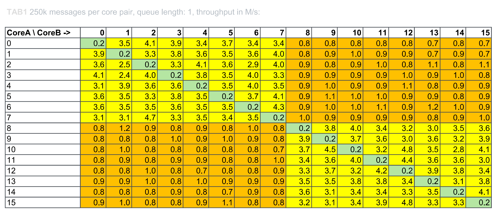
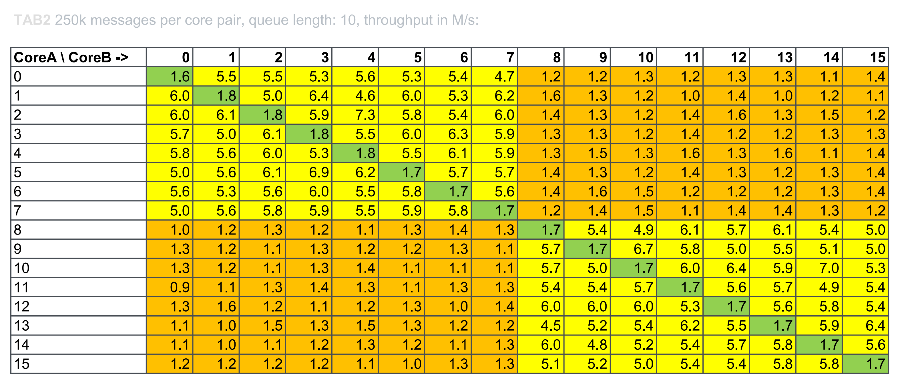
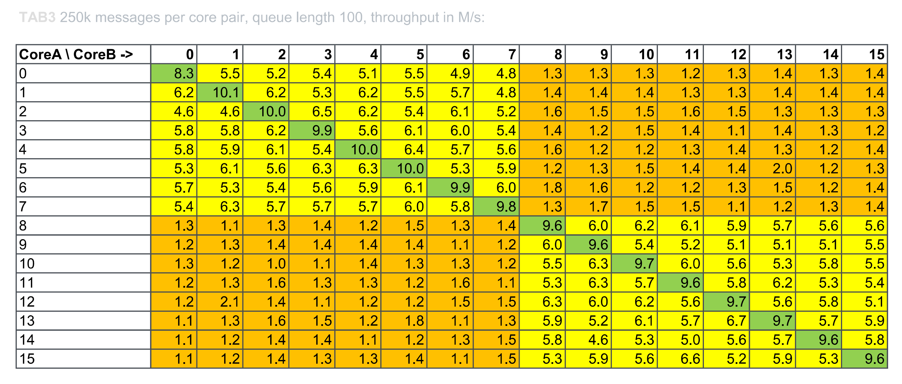
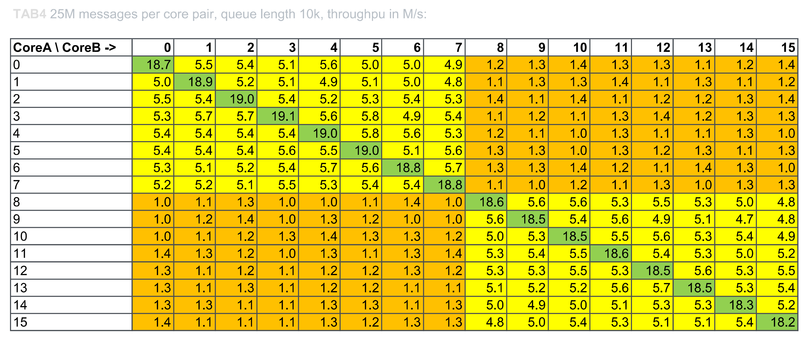
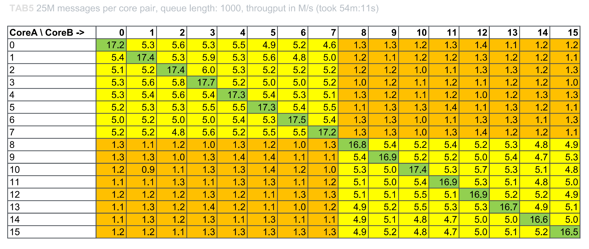
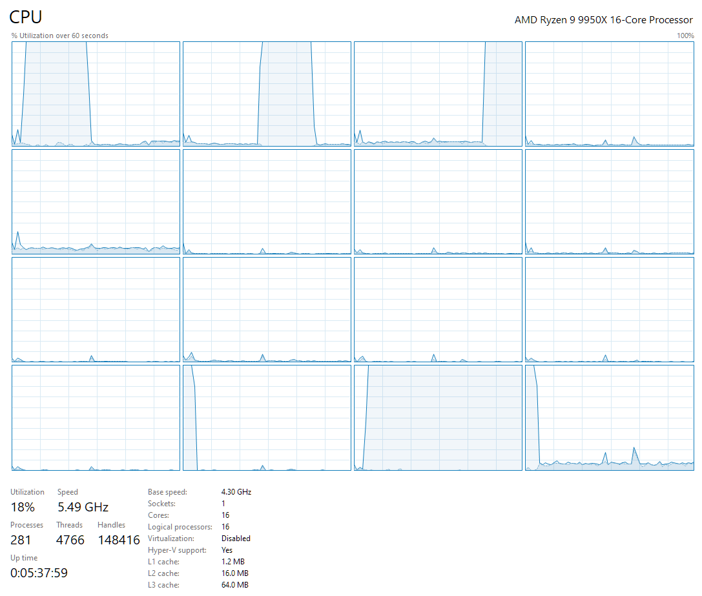

# Zen5 and C#

Zen 5 landed with a bit of controversy, but anyone Who was paying any attention to the real results wasn't disappointed. Benchmarks done using more mature OSes (like Linux and Win10) and professional software shown its strengths.
But hey, why should we trust just any 3rd party data if we can make a test by ourselves? I used Ryzen 9950x today and a bit of code to get things going.

I am often processing large piles of data. While this is normally executed on different HW than my personal PC, it is always nice to have the computing power locally.
What is counterintuitive in a case of data processing: more CPU cores may not bring better performance. In a CPU heavy tasks (like rendering) this is not apparent, but when the CPU work is combined with synchronization and data transfers the core to core latency, data locality, OS scheduler and other thigs are coming into play.
I promised a practical example, so lets examine this old problem of producer and consumer. We will dive into details soon, but now lets focus on the main code part. I am using C# with .NET 8.0 and Win10 here.

```csharp
    IntPtr mask1 = new(1 << core1);
    IntPtr mask2 = new(1 << core2);

    SemaphoreSlim semaphoreProducer = new(queueSize);
    SemaphoreSlim semaphoreConsumer = new(0);

    string[] message = new string[queueSize];
    int reader = -1;
    int writer = -1;
```

In the code above we define 2 affinity masks which are binary vectors of ones and zeroes hidden inside single `int` type. We allow only one core in each mask, values for core1 and core2 are within the range 0..15 (I disabled SMT for this test, otherwise we would have to deal with virtual cores as well).
I use two semaphores for tight control of producer and consumer threads. The producer could produce only up to `queueSize` messages and consumer could consume only as many messages as are available without blocking.
Array `message` is our queue and reader/writer index is used to address next message (or empty spot) in our queue.

```csharp
Thread producerThread = new(() =>
{
    ThreadGuard.GetInstance(mask1).Guard();
    for (int i = 1; i <= messagesToProcess; i++)
    {
        semaphoreProducer.Wait();

        int index = Interlocked.Increment(ref writer);
        message[index % queueSize] = i.ToString();

        semaphoreConsumer.Release();
    }
});
```

Here comes the producer thread. First thing we do is the affinity setting. `ThreadGuard` implementation is a technical detail for which You have to scroll a bit further, it ensures that the thread it is called from will get executed only on the core(s) we defined by a mask.
We produce desired number of messages in a for loop. Each message needs it own place in a queue so we do `semaphoreProducer.Wait()` as a first thing. Initial capacity of this semaphore is `queueSize`, so there is plenty of place from the start.
We are looping through spots in a queue thanks to modulo operation, thus `index % queueSize`.
The call `semaphoreConsumer.Release()` is actually telling the consumer about the new message we just prepared.

```csharp
Thread consumerThread = new(() =>
{
    ThreadGuard.GetInstance(mask2).Guard();
    int i = 0;   
    do {
        semaphoreConsumer.Wait();

        int index = Interlocked.Increment(ref reader);
        i = int.Parse(message[index % queueSize]);

        semaphoreProducer.Release();
       } while (i < messagesToProcess);
});
```

Consumer part looks like a mirror of the producer, we wait in `semaphoreConsumer.Wait()` until there is some message to consume, once we are done the `semaphoreProducer.Release()` call signals the producer that the place in queue is now free for a new message.
Whole party is going on until we produce and consume desired amount of messages.

Complete `ThreadGuard` code looks like this:

```csharp
using System;
using System.Collections.Concurrent;
using System.Runtime.InteropServices;

public class ThreadGuard
{
    // Import SetThreadAffinityMask from kernel32.dll
    [DllImport("kernel32.dll")]
    private static extern IntPtr SetThreadAffinityMask(IntPtr hThread, IntPtr dwThreadAffinityMask);

    // Import GetCurrentThread from kernel32.dll
    [DllImport("kernel32.dll")]
    private static extern IntPtr GetCurrentThread();
    
    private static readonly ConcurrentDictionary<IntPtr, ThreadGuard> GuardPool = new();
    
    private readonly IntPtr mask;

    private ThreadGuard(IntPtr mask) { this.mask = mask; }

    public static ThreadGuard GetInstance(IntPtr affinityMask) // factory method
    {
        return GuardPool.GetOrAdd(affinityMask, _ => new ThreadGuard(affinityMask));
    }

    public void Guard()
    {

        IntPtr currentThreadHandle = GetCurrentThread();                  // Get the handle of the current thread
        IntPtr result = SetThreadAffinityMask(currentThreadHandle, mask); // Set the thread affinity mask
        if (result == IntPtr.Zero) { throw new InvalidOperationException("Failed to set thread affinity mask."); }
    }
}
```

Now the best part - let's run this for all pairs of cores and various queue sizes.
All measured numbers are millions of transferred messages per second. Row numbers on a left are "producer" cores and column numbers on top are "consumer" cores.



Starting with queue length of 1 we are not letting any thread to produce more than 1 message without blocking. This looks interesting. Even worse than talking to another CCD is the single core trying to execute two things at once. I am surely not alone who hates to do context switching while working on multiple tasks. Solution to this (as visible later) is to at least do more work on a single task before switching to another one.
For those who still wonder why is this so bad - we are really not allowing any thread to do any useful work until the other thread gets its fair share of CPU time. Measured throughput of messages is at the same time also measuring number of context switches between consumer and producer threads by the OS when only single CPU core is used.
When we shift our attention to the single vs. cross CCD communication using 2 cores, it comes about 5x slower.




When allowed to post at least 10 messages into queue at once, single core score surpasses the cross CCD score by a little. With queue length of 100, the single core score is already the fastest.




Finally the 25M messages exchanged for each pair with queue length of 1k and 10k messages. It took almost an hour to collect each. Single core, single CCD and cross CCD latencies are clearly separated by our own test.



It didn't took any sophisticated equipment or software, yet We were able to gain valuable insight into performance characteristics of a modern multi core and multi CCD CPU.

If You have any questions, ideas or if You believe I am completely wrong, please leave me a comment below!


 